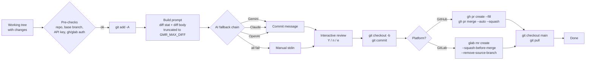

<div align="center">

# gmr

**Git Merge Request automation — one command from `git add` to a merged PR/MR.**

[](https://github.com/slucheninov/gmr/actions/workflows/ci.yml)
[](https://github.com/slucheninov/gmr/releases/latest)
[](https://pkg.go.dev/github.com/slucheninov/gmr)
[](https://goreportcard.com/report/github.com/slucheninov/gmr)
[](LICENSE)

</div>

`gmr` is a small, dependency-light CLI that takes a dirty working tree and turns
it into a reviewed-and-mergeable Pull Request (GitHub) or Merge Request (GitLab).
It stages the changes, drafts a [Conventional Commits](https://www.conventionalcommits.org/)
message with an LLM, creates a feature branch, opens the PR/MR with the right
title and description, and switches you back to the base branch.

```bash
# instead of: git add -A && git commit -m "..." && git push -u origin foo \
#             && gh pr create --fill && gh pr merge --auto --squash && git checkout main && git pull
gmr
```

## Table of Contents

- [Features](#features)
- [Demo](#demo)
- [Installation](#installation)
- [Quick Start](#quick-start)
- [Usage](#usage)
- [Configuration](#configuration)
- [How it works](#how-it-works)
- [Architecture](#architecture)
- [Development](#development)
- [Contributing](#contributing)
- [Security](#security)
- [License](#license)

## Features

- **Multi-provider AI** — Gemini → Claude → OpenAI fallback chain, with manual
  input as the last resort. Plug in your favourite key, others are optional.
- **Cross-platform git host** — auto-detects GitHub vs GitLab from the `origin`
  remote and uses `gh` or `glab` accordingly.
- **Conventional Commits** — opinionated prompt produces lint-friendly messages
  (`type: description`, optional body up to 3 bullets).
- **Interactive review** — accept (`Y`), reject and retype (`n`), or edit in
  `$EDITOR` (`e`) before the commit lands.
- **Safe by default** — clean exit on `SIGINT`/`SIGTERM`, automatic return to
  the base branch even if MR/PR creation fails, gracefully degrades when
  GitHub auto-merge is disabled.
- **Single static binary** — written in Go, no runtime dependencies on `jq` /
  `curl` / Bash. Pre-built for macOS, Linux, and Windows (amd64 + arm64).
- **Smart defaults** — base branch resolves from `origin/HEAD` (no more
  `main` vs `master` papercuts). Branch name is auto-generated as
  `auto/YYYYMMDD-HHMMSS` when omitted.

## Demo

```text
$ gmr
▸ Platform: github
▸ Branch: auto/20260425-141523
▸ Generating commit message via Gemini API...

Generated commit message:
────────────────────────────
feat: add retry policy for AI providers

- exponential backoff with jitter (max 3 attempts)
- per-provider HTTP client timeout (30s)
- log final error before falling through to next provider
────────────────────────────

Accept? [Y/n/e(edit)]: y
▸ Creating branch 'auto/20260425-141523'...
▸ Committing...
▸ Creating Pull Request...
▸ Enabling auto-merge (squash)...
▸ Switching back to main...
✔ Done! PR created, you are on main
```

## Installation

### Pre-built binary (recommended)

Pick the asset for your OS / arch from the [latest release](https://github.com/slucheninov/gmr/releases/latest):

```bash
# Detect latest version
VERSION=$(curl -fsSL https://api.github.com/repos/slucheninov/gmr/releases/latest | jq -r .tag_name)

# Pick: linux-amd64 | linux-arm64 | darwin-amd64 | darwin-arm64
OS_ARCH=linux-amd64

curl -L -o gmr.tar.gz \
  "https://github.com/slucheninov/gmr/releases/download/${VERSION}/gmr-${VERSION}-${OS_ARCH}.tar.gz"
tar -xzf gmr.tar.gz
sudo install -m 0755 gmr /usr/local/bin/gmr
gmr --version
```

**Windows** (PowerShell):

```powershell
$VERSION = (Invoke-RestMethod https://api.github.com/repos/slucheninov/gmr/releases/latest).tag_name
$ARCH    = "amd64"   # or "arm64"
Invoke-WebRequest -Uri "https://github.com/slucheninov/gmr/releases/download/$VERSION/gmr-$VERSION-windows-$ARCH.zip" -OutFile gmr.zip
Expand-Archive gmr.zip -DestinationPath $Env:USERPROFILE\bin
$Env:Path += ";$Env:USERPROFILE\bin"
gmr --version
```

Verify the checksum (every release ships `checksums.txt`):

```bash
curl -L -O "https://github.com/slucheninov/gmr/releases/download/${VERSION}/checksums.txt"
sha256sum -c checksums.txt --ignore-missing
```

### Go toolchain

```bash
go install github.com/slucheninov/gmr/cmd/gmr@latest
```

The binary lands in `$(go env GOBIN)` (defaults to `~/go/bin`). Make sure that
directory is in your `PATH`.

### From source

```bash
git clone https://github.com/slucheninov/gmr.git
cd gmr
go build -o gmr ./cmd/gmr
sudo install -m 0755 gmr /usr/local/bin/gmr
```

## Quick Start

1. Install one of the supported CLIs and authenticate it:

   ```bash
   # GitHub
   brew install gh && gh auth login
   # — or — GitLab
   brew install glab && glab auth login
   ```

2. Export at least one AI provider key (any combination works; gmr tries them
   in order Gemini → Claude → OpenAI):

   ```bash
   export GEMINI_API_KEY=...      # Google AI Studio
   export ANTHROPIC_API_KEY=...   # Anthropic Console
   export OPENAI_API_KEY=...      # OpenAI Platform
   ```

3. Make some changes on the base branch (`main` / `master` / your override),
   then run:

   ```bash
   gmr
   ```

## Usage

```text
gmr [branch-name]   # full flow: commit + PR/MR + auto-merge
gmr -m              # generate commit message only (prints to stdout)
gmr -h              # help
gmr -v              # version
```

Pipe-friendly examples:

```bash
# Use the AI message in another tool, with no side effects
gmr -m | tee /tmp/msg.txt

# Inspect a generated message and only commit if it looks good
msg=$(gmr -m) && echo "$msg" && git commit -m "$msg"
```

## Configuration

All configuration is via environment variables — no config file, no flags
beyond `-m` / `-h` / `-v`.

### Required (at least one)

| Variable | Description |
|---|---|
| `GEMINI_API_KEY` | [Google Gemini](https://aistudio.google.com/app/apikey) API key |
| `ANTHROPIC_API_KEY` | [Anthropic Claude](https://console.anthropic.com/) API key |
| `OPENAI_API_KEY` | [OpenAI](https://platform.openai.com/api-keys) API key |

### Optional

| Variable | Description | Default |
|---|---|---|
| `GMR_MAIN_BRANCH` | Base branch | auto-detect (`origin/HEAD`, fallback `main` / `master`) |
| `GMR_GEMINI_MODEL` | Gemini model | `gemini-flash-latest` |
| `GMR_ANTHROPIC_MODEL` | Claude model | `claude-sonnet-4-20250514` |
| `GMR_OPENAI_MODEL` | OpenAI model | `gpt-4o-mini` |
| `GMR_MAX_DIFF` | Max diff lines sent to the LLM | `500` |
| `EDITOR` | Editor used by the `e(edit)` choice | `vim` |
| `NO_COLOR` | Disable ANSI colors in log output | — |

## How it works



Notes:

- The base branch is detected from `origin/HEAD`. If your repo doesn't have it
  configured, set `GMR_MAIN_BRANCH` or run
  `git remote set-head origin --auto`.
- For GitLab, `gmr` always passes an explicit `--title` / `--description` so
  the MR is created non-interactively. When the commit message has no body,
  a short `## Summary` section is generated from the title.
- For GitHub, if the repo has auto-merge disabled, `gmr` warns and continues
  instead of failing.
- `SIGINT` / `SIGTERM` is caught — gmr returns you to the base branch before
  exiting non-zero.

## Architecture

```text
cmd/gmr/main.go             CLI entry point and orchestration
internal/ai/                Gemini / Claude / OpenAI providers (Provider interface)
internal/git/               git wrapper with a testable Runner interface
internal/platform/          host detection (github.com / gitlab.com) + project path parsing
internal/commit/            commit-message helpers (Title / Body / MRDescription)
internal/ui/                logging + ANSI colors (honors NO_COLOR), all to stderr
internal/version/           Version constant (override at link time via -ldflags)
```

The `ai.Provider` interface is the extension point for new providers — see
`internal/ai/gemini.go` as a reference implementation.

## Development

### Prerequisites

- Go **1.25+**
- Optional: [`golangci-lint`](https://golangci-lint.run/) v2

### Build, test, lint

```bash
go build ./cmd/gmr
go test -race ./...
go test -race -coverprofile=coverage.out ./... && go tool cover -func=coverage.out
go vet ./...
golangci-lint run
```

### What's covered by tests

- Platform detection (`Detect`, `GitLabProjectPath`) — GitHub / GitLab,
  SSH / HTTPS, with and without `.git`, nested groups.
- Commit-message helpers (`Title`, `Body`, `MRDescription`) — with and
  without body.
- Base-branch resolution — `GMR_MAIN_BRANCH` override → `origin/HEAD` →
  `main` / `master` fallback.
- Diff-line truncation (`LimitLines`).
- AI providers — happy path, API error payloads, and truncation handling for
  Gemini `MAX_TOKENS` / Claude `max_tokens` / OpenAI `length` (all via
  `httptest`).

## Contributing

Contributions of all kinds are welcome — bug reports, fixes, new AI
providers, docs, tests. See **[CONTRIBUTING.md](CONTRIBUTING.md)** for the
full workflow, coding guidelines, and a checklist for adding new providers.

This project adheres to the [Code of Conduct](CODE_OF_CONDUCT.md).

## Security

If you discover a security vulnerability, please **do not** open a public
issue. See **[SECURITY.md](SECURITY.md)** for the responsible-disclosure
process and supported versions.

## License

[MIT](LICENSE) © Slava Lucheninov and contributors.
